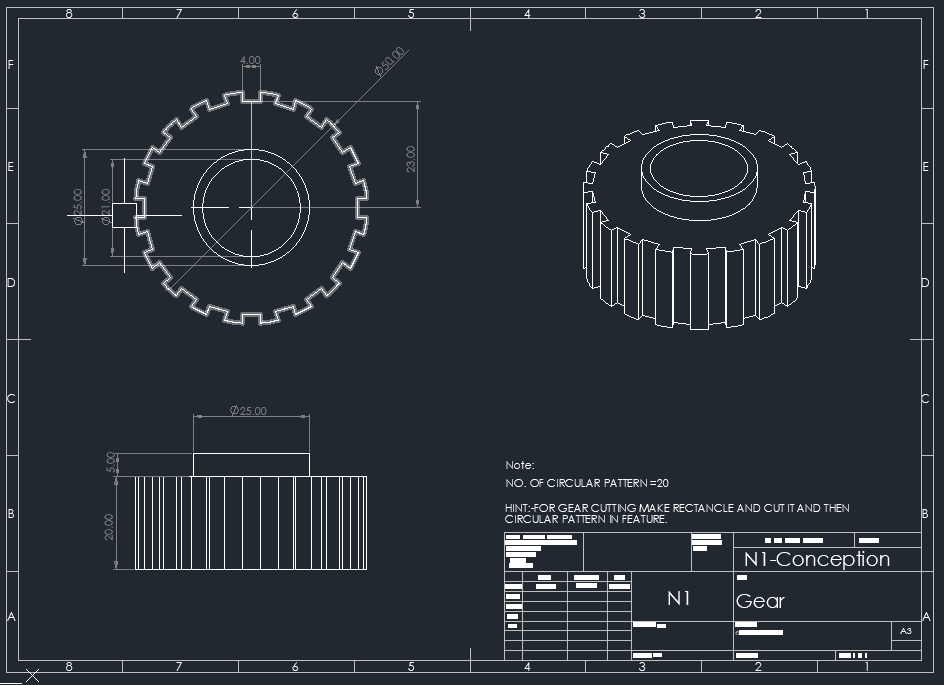

# Part-drawing-1-Auto-CAD

# ⚙️ 2D Gear Drawing Showcase (AutoCAD)

## 📌 Overview

This project is a **2D technical drawing showcase** created using **AutoCAD**, featuring a detailed **gear design** presented through multiple standard views. It demonstrates fundamental drafting principles, precision, and proper engineering drawing practices.

The goal of this project is to highlight skills in **2D drafting, dimensioning, and visualization** by representing a mechanical component (gear) in a clear and professional format.

---

## 🛠️ Software Used

* AutoCAD (2D Drafting)

---

## 📐 Project Features

* Accurate **2D gear design**
* Multiple orthographic views:

  * Front View

  * Top View

  * Side View

* Proper **dimensioning and annotations**

* Clean and organized **layer management**

* Use of standard drafting conventions

## 🎯 Learning Objectives

Through this project, I practiced:

* Creating precise 2D geometry in AutoCAD
* Applying **orthographic projection techniques**
* Adding **dimensions and tolerances**
* Understanding **mechanical component representation**

---

## 📚 Applications

This project is useful for:

* Mechanical design basics
* Engineering drawing practice
* Portfolio showcase for CAD skills

---

## 🙌 Acknowledgment

This is a self-created project intended for learning and demonstration purposes.

---

## 📬 Contact

If you have feedback or suggestions, feel free to reach out or open an issue.

---

⭐ If you found this useful, consider giving it a star!

---

Thank You for Viewing!

## License
this project is licensed under the MIT license.

